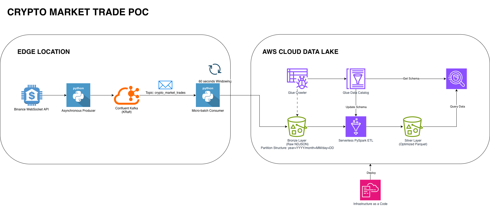

# Real-Time Market Data Ingestion Pipeline

A Proof of Concept (POC) demonstrating a high-throughput, real-time streaming data pipeline. It ingests unbounded WebSocket tick data, buffers it via a local message broker, and micro-batches it into a serverless data lake architecture for ad-hoc querying.

## 🏗️ Architecture Overview

This pipeline simulates the ingestion of high-velocity financial market data (tick data) using a decoupled, event-driven architecture.

### Architecture V1: Local Broker (Legacy State)

This repository contains the functional Proof of Concept, demonstrating the core mechanics of stream buffering, idempotent S3 writes, and traditional Hive-style partitioning.


*(Note: Update your diagram image to reflect V2 Firehose & Iceberg architecture when ready!)*

1. **Data Source:** Public WebSocket API (`wss://stream.binance.com:9443/ws/btcusdt@aggTrade`) streaming live BTC/USDT aggregate trades.
2. **Message Broker:** Confluent Kafka (KRaft mode) running locally to provide durable buffering and handle backpressure.
3. **Producer (`producer.py`):** An asynchronous Python client that reads the continuous WebSocket stream and publishes events to the `crypto_market_trades` Kafka topic.
4. **Consumer/Sink (`consumer.py`):** A Python consumer that reads from Kafka, micro-batches messages into 60-second windows, and flushes newline-delimited JSON (NDJSON) to Amazon S3 using Hive-style partitioning (`year=YYYY/month=MM/day=DD`).
5. **Data Catalog & Analytics (AWS):** An AWS Glue Crawler infers the schema of the S3 data lake and registers it in the AWS Glue Data Catalog, enabling serverless ANSI SQL querying via Amazon Athena.
6. **Silver Layer Processing (AWS Glue ETL):** A serverless PySpark job (`bronze_to_silver_etl.py`) processes the fragmented JSON files, casts schema data types, and compacts the data into optimized Parquet format to solve the "Small File Problem."

### Architecture V2: Serverless & Apache Iceberg (Current State)

To scale this architecture, eliminate connection exhaustion, and remove the operational overhead of manual partition management, the pipeline was upgraded to a fully serverless Medallion architecture.

1. **Compute Layer (AWS Fargate):** The ingestion engine is containerized via Docker and runs 24/7 on AWS Fargate, decoupling the producer from local hardware and providing highly available serverless compute.
2. **Ingestion (Kinesis Firehose):** Replaced the local Kafka broker. The Fargate Python producer implements **client-side micro-batching** (100 messages/batch) to stream data directly into Amazon Kinesis Firehose, eliminating WebSocket connection exhaustion and handling massive throughput.
3. **Bronze Layer (Raw):** Firehose automatically buffers the high-velocity stream and delivers raw JSON files into S3 (`s3://.../bronze/trades/`).
4. **Silver Layer Processing (AWS Glue ETL):** A serverless PySpark job runs on a **native 15-minute scheduled trigger** to process the Bronze data, enforce schema (handling upstream case-sensitivity conflicts from the exchange), and utilize the **Spark SQL V2 API**.
5. **Analytics (Apache Iceberg):** The Silver layer is written as an **Apache Iceberg** table. This completely replaces traditional Hive/Parquet files, providing true ACID transactions, automated metadata management, and instant query availability in Amazon Athena with zero `MSCK REPAIR TABLE` commands.

## ⚙️ Prerequisites

* Docker Desktop (Required for V1 Kafka and V2 ECR Image Building)
* Python 3.10+
* [Poetry](https://python-poetry.org/) (Dependency Management)
* AWS CLI configured with SSO

## 🚀 Deployment & Execution Runbook

### Environment Configuration
This project follows 12-Factor App principles. Copy the example environment file and insert your specific AWS bucket and Kafka details.

```bash
cp .env.example .env
````

### 1\. Infrastructure as Code (AWS)

Provision the S3 Data Lake, Glue Database, IAM least-privilege roles, ECS Cluster, and Glue Jobs via the provided CloudFormation template.

```bash
chmod +x deploy.sh
./deploy.sh
```

*(Note: Update the `S3_BUCKET` variable in `.env` file to match the exact bucket name created by this stack).*

-----

### 🟢 OPTION A: Running Legacy Version 1 (Local Kafka)

**2. Local Kafka Cluster**
Spin up the local single-node Kafka broker (KRaft mode).

```bash
docker-compose up -d
poetry install
```

**3. Pipeline Execution**
Run the pipeline by starting the sink and the stream in separate terminals:

```bash
# Terminal 1: Start the Consumer/Sink
poetry run python src/consumer.py

# Terminal 2: Start the Producer/Stream
poetry run python src/producer.py
```

**4. Cataloging & Analytics**
After 2-3 minutes of data generation, trigger the AWS Glue Crawler:

```bash
aws glue start-crawler --name crypto_market_crawler
```

Query via Athena once complete. Run the Silver Layer Transformation (`crypto_bronze_to_silver_etl`) to compact files, and use `MSCK REPAIR TABLE` to load the new Parquet partitions.

-----

### 🔵 OPTION B: Running Current Version 2 (Fargate & Iceberg)

**2. Container Registry Setup (Amazon ECR)**
Create an Amazon Elastic Container Registry to securely store the ingestion engine's Docker image.

```bash
aws ecr create-repository --repository-name crypto-firehose-producer --region ap-southeast-2
```

**3. Build & Push the Docker Image**
Build the container natively for cloud deployment (ensuring AMD64 compatibility for Fargate) and push it to AWS ECR. *(Replace `<YOUR_ACCOUNT_ID>` with your 12-digit AWS account number).*

```bash
# Build the image
docker build --platform linux/amd64 -t crypto-firehose-producer .

# Authenticate with AWS ECR
aws ecr get-login-password --region ap-southeast-2 | docker login --username AWS --password-stdin <YOUR_ACCOUNT_ID>.dkr.ecr.ap-southeast-2.amazonaws.com

# Tag and Push
docker tag crypto-firehose-producer:latest <YOUR_ACCOUNT_ID>[.dkr.ecr.ap-southeast-2.amazonaws.com/crypto-firehose-producer:latest](https://.dkr.ecr.ap-southeast-2.amazonaws.com/crypto-firehose-producer:latest)
docker push <YOUR_ACCOUNT_ID>[.dkr.ecr.ap-southeast-2.amazonaws.com/crypto-firehose-producer:latest](https://.dkr.ecr.ap-southeast-2.amazonaws.com/crypto-firehose-producer:latest)
```

**4. Start the Ingestion Engine (AWS Fargate)**
Navigate to the **AWS ECS Console**, select the `crypto-market-cluster`, and run a new Task using the `crypto-firehose-producer` task definition in your default VPC. The container will automatically assume the IAM Task Role, pull credentials, and begin streaming data to Firehose.

**5. Automated Silver Layer Transformation (Bronze to Iceberg)**
The CloudFormation stack includes a native **AWS Glue Scheduled Trigger** that automatically runs the ETL job every 15 minutes. This job reads the raw JSON, dynamically creates the Iceberg table on its first run, and safely appends data on all subsequent runs.

*(Optional) To see data immediately without waiting for the 15-minute cron cycle, trigger it manually:*

```bash
aws glue start-job-run --job-name firehose_bronze_to_silver_etl
```

**6. Real-Time Analytics (Amazon Athena)**
Because this pipeline uses Apache Iceberg, there is no need to run Crawlers or repair partitions. Once the Glue job succeeds, the data is instantly available in Athena:

```sql
SELECT 
    event_time_ms,
    trade_price,
    trade_quantity,
    is_market_maker
FROM "crypto_market_db"."silver_firehose_trades_iceberg"
ORDER BY event_time_ms DESC
LIMIT 100;
```

## 🧠 Design Decisions & Trade-Offs

  * **Push vs. Poll:** A live WebSocket was chosen over a REST API (like Yahoo Finance) to properly simulate the unbounded, push-based nature of exchange market data (e.g., FIX/ITCH protocols) and to test asynchronous I/O handling.
  * **Producer Micro-Batching:** Calling the AWS API for every individual tick resulted in `boto3` connection exhaustion ("Broken Pipes"). Implementing a local array buffer before calling `put_record_batch` solved the latency bottleneck and drastically reduced AWS API costs.
  * **Serverless Compute (Fargate) & Fault Tolerance:** By containerizing the producer and moving it to AWS Fargate, the pipeline is no longer bound to local hardware. Utilizing ECS Services ensures that if the WebSocket drops (Broken Pipe) and the Python script crashes, Fargate automatically spins up a replacement container, ensuring high availability at a fraction of the cost of dedicated EC2 instances.
  * **Orchestration (Native Glue vs. EventBridge):** While Amazon EventBridge is the standard for decoupled orchestration, using it to trigger a standalone Glue job requires unnecessary cross-service IAM `PassRole` permissions. Pivoting to AWS Glue's native Scheduled Triggers achieved the exact same 15-minute micro-batching automation with zero IAM overhead, strictly adhering to the principle of least privilege.
  * **Shadow Pipeline Migration:** To safely migrate from Kafka to Firehose, both pipelines were run simultaneously. Separate Glue Crawlers and prefix-isolated tables (`firehose_trades`) were used to ensure exact data parity before deprecating the local broker.
  * **Apache Iceberg vs. Hive Partitioning:** Real-time streaming into traditional S3 data lakes creates the "invisible data" problem, requiring constant partition updates via `MSCK REPAIR`. Upgrading the Silver layer to Apache Iceberg shifted the paradigm from folder-based tracking to file-level transaction logs, enabling instant query availability and background compaction.

## ⚠️ Disclaimer

This project is a Proof of Concept (POC) built strictly for **educational and personal portfolio purposes**.

  * **No Affiliation:** I am not affiliated, associated, authorized, endorsed by, or in any way officially connected with Binance, any cryptocurrency exchange, or any traditional financial institution (banks, brokerages, etc.).
  * **Not Financial Advice:** The data ingested and processed by this pipeline is for demonstration purposes only. Nothing in this repository constitutes financial, investment, or trading advice.
  * **Use at Your Own Risk:** Real-time market data pipelines can incur significant cloud infrastructure costs if left running. Please ensure you tear down all AWS resources (`aws cloudformation delete-stack`) when you are finished testing.

## 📄 License

This project is licensed under the MIT License - see the [LICENSE](https://www.google.com/search?q=LICENSE) file for details.

⚙️ Engineered by Evan G.